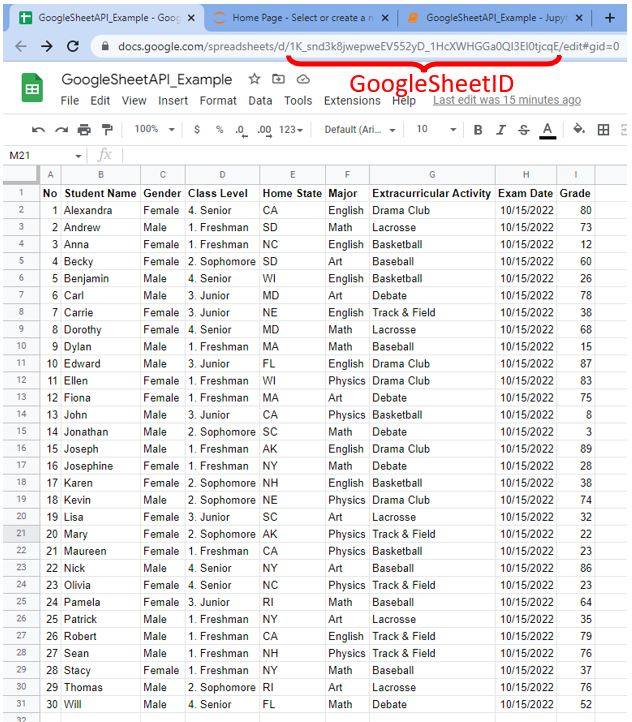
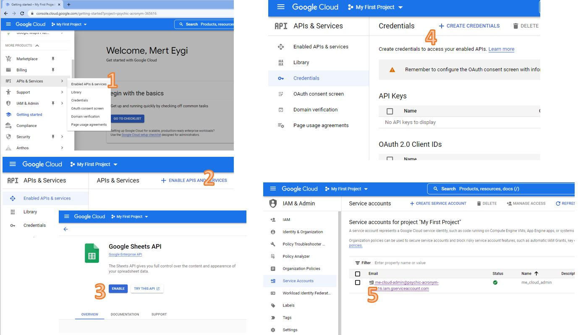
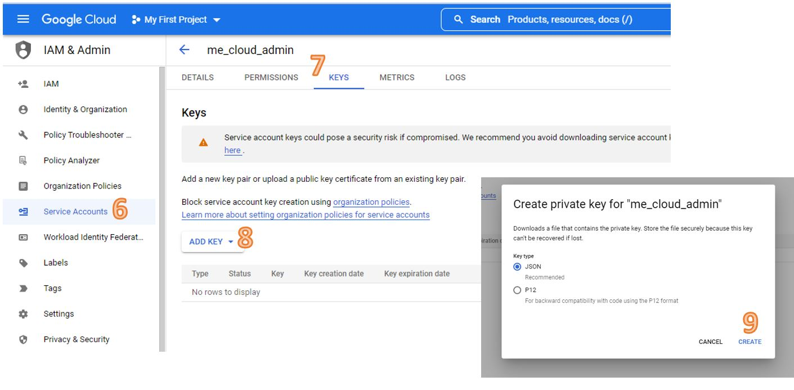

# GoogleSheetAPIwPython
Get data from a google sheet by using google cloud console and python.

The [GoogleSheetAPI_Example.ipynb](https://github.com/merteygi/GoogleSheetAPIwPython/blob/main/GoogleSheetAPI_Example.ipynb) shows an example to read a data from your google sheet in seconds. You can use my <b>get_data_google_sheet</b> function just changing its necessary input paremeters. <br>

```python
def get_data_google_sheet(SCOPES,SERVICE_ACCOUNT_FILE,MY_SPREADSHEET_ID,MY_RANGE_NAME):
    from googleapiclient.discovery import build
    from google.oauth2 import service_account

    creds = None
    creds = service_account.Credentials.from_service_account_file(SERVICE_ACCOUNT_FILE, scopes=SCOPES)

    service = build('sheets', 'v4', credentials=creds)
    # Call the Sheets API
    sheet = service.spreadsheets()
    result = sheet.values().get(spreadsheetId=MY_SPREADSHEET_ID,range=MY_RANGE_NAME).execute()
    #values = result.get('values', [])

    df = pd.DataFrame.from_dict(data =result['values'][1:])
    df.columns = res

df = get_data_google_sheet(SCOPES,SERVICE_ACCOUNT_FILE,MY_SPREADSHEET_ID,MY_RANGE_NAME)
```
<b>input parameters</b>;
```python
#READ-ONLY Access to Google Sheet
SCOPES = ['https://www.googleapis.com/auth/spreadsheets.readonly']
#YourServiceAccountFile
SERVICE_ACCOUNT_FILE = 'C:\\Users\\mert.eygi\\GoogleSheetAPIwPython\\my_google_cloud_key.json'

#YourGoogleSheetID 
MY_SPREADSHEET_ID = '1K_snd3k8jwepweEV552yD_1HcXWHGGa0QI3EI0tjcqE'
#YourSheetName
MY_RANGE_NAME = 'MySheetName!A:I'
```

To do that, you need to follow just few steps.
* Openning a  [Google Cloud Conslole](https://console.cloud.google.com/) account. Although it needs a credit card information, you will have $300 credit for free.
* Open a project in it
* Enable the Google Sheet API
* Create a service account in 
* Inside the service account, create a key file and store the downloaded json file (you can freely change its name ) 
* Give a access permission of your Google Sheet to your Google Cloud Service Account Email Address

You can also check this link if necessary -> [https://developers.google.com/sheets/api/quickstart/python](https://developers.google.com/sheets/api/quickstart/python)


## ScreenShots 
### My Example Google Sheet 

### Google Account Settings ScreenShots


